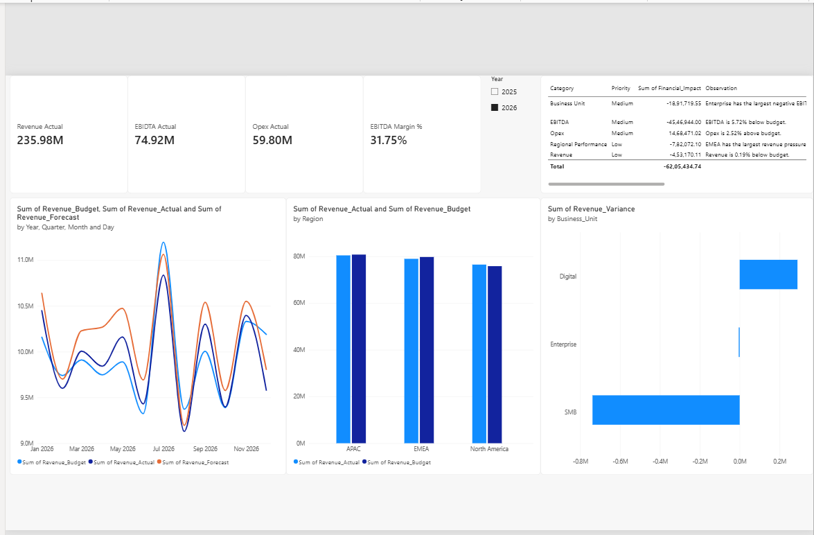
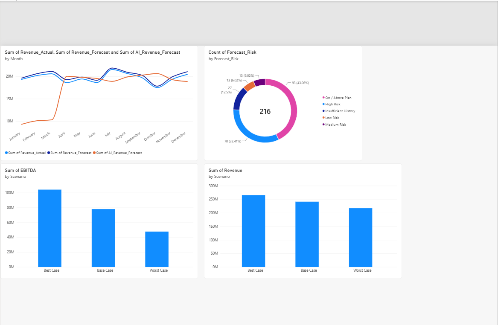
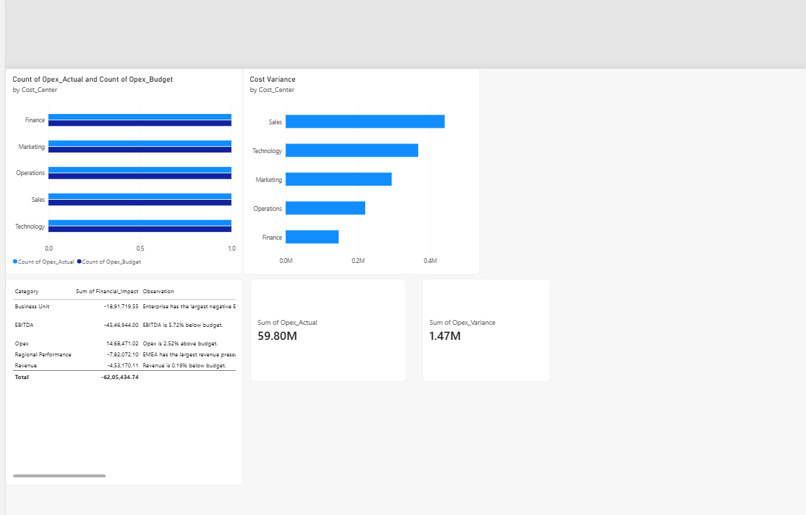

# FP&A Finance Analytics Automation

An end-to-end FP&A automation and analytics portfolio project combining Python, financial modelling, automated management insights, and Power BI.

The project demonstrates how recurring FP&A activities such as data preparation, variance analysis, forecasting, scenario modelling, cost-center analysis, management reporting, and dashboarding can be integrated into a modular analytics workflow.

> This project uses synthetic financial data created for portfolio demonstration purposes.

## Project Architecture

```text
Financial Data
      |
      v
Python FP&A Pipeline
      |
      +-- Data Ingestion & Validation
      +-- Variance Analysis
      +-- Rolling Forecasting
      +-- Scenario Analysis
      +-- Cost Center Analysis
      +-- Management Insights
      |
      v
Automated Excel Reporting
      |
      v
Power BI Dashboard
      |
      v
Management Decision Support
```

## Key Features

- Automated financial data ingestion and validation
- Actual vs Budget variance analysis
- Revenue, Opex and EBITDA performance analysis
- 3-month rolling revenue forecasting model
- Forecast risk classification
- Base, Best and Worst scenario modelling
- Cost-center Opex analysis
- Automated management insights and recommended actions
- Automated multi-sheet Excel management report
- Interactive Power BI dashboard

## Power BI Dashboard

The Power BI report contains three analytical pages:

1. **Executive FP&A Overview**
   - Revenue, EBITDA, Opex and EBITDA Margin KPIs
   - Monthly Actual vs Budget vs Forecast
   - Regional revenue performance
   - Business-unit variance analysis
   - Management insights

2. **Forecast & Scenario Intelligence**
   - Actual vs Business Forecast vs Python Rolling Forecast
   - Forecast risk distribution
   - Base / Best / Worst scenario analysis
   - Revenue and EBITDA scenario impact

3. **Cost Center & Management Insights**
   - Cost-center Opex performance
   - Actual vs Budget analysis
   - Cost variance analysis
   - Management observations and actions

## Dashboard Screenshots

### Executive FP&A Overview



### Forecast & Scenario Intelligence



### Cost Center & Management Insights



## Technology Stack

- Python
- Pandas
- NumPy
- OpenPyXL
- Power BI
- DAX
- Excel
- Git / GitHub

## Project Structure

```text
agents/
  ingestion_agent.py
  variance_agent.py
  forecasting_agent.py
  scenario_agent.py
  costcenter_agent.py
  insights_agent.py

data/
  financials.csv
  financials.xlsx

output/
  final_report.xlsx

screenshots/
  executive_overview.png
  forecast_scenario.png
  cost_center_insights.png

generate_data.py
main.py
requirements.txt
FP&A_Finance_Analytics_Dashboard.pbix
README.md
```

## Run the Project

Install the required Python packages:

```bash
pip install -r requirements.txt
```

Generate the synthetic FP&A dataset:

```bash
python generate_data.py
```

Run the complete FP&A analytics pipeline:

```bash
python main.py
```

The automated management report will be generated at:

```text
output/final_report.xlsx
```

The Power BI dashboard can then be opened using:

```text
FP&A_Finance_Analytics_Dashboard.pbix
```

## FP&A Use Cases Demonstrated

This portfolio project demonstrates practical application of:

- Budget vs Actual analysis
- Forecasting
- Financial modelling
- Management reporting
- Revenue and cost analysis
- EBITDA analysis
- Scenario planning
- Cost-center controlling
- Finance data analytics
- Power BI reporting
- Python-based finance automation

## Disclaimer

All financial data used in this repository is synthetic and created solely for portfolio and learning purposes. It does not contain confidential or proprietary company information.